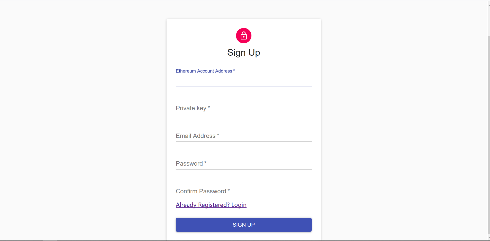
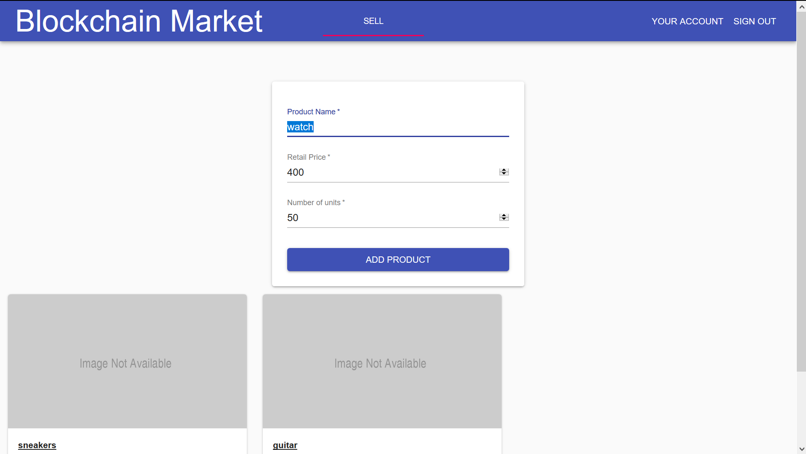
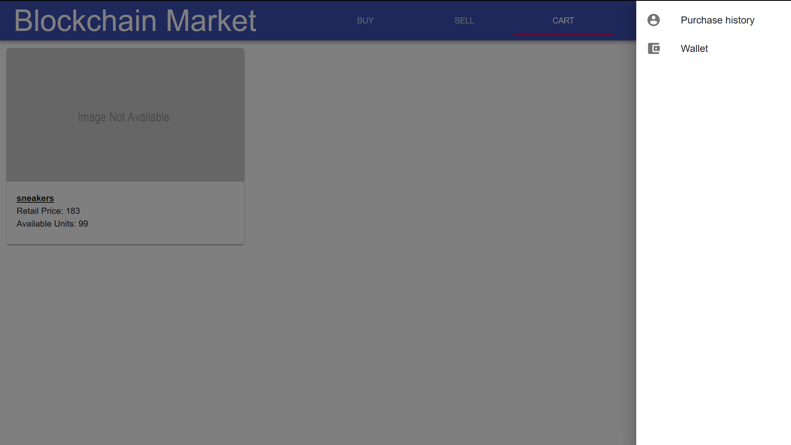

Decentralized Market Place using Blockchain

## Foreword:

- The live version of this app is at [http://blockchain-market.herokuapp.com/](http://blockchain-market.herokuapp.com/)
- The blockchain for the live website is hosted on a full node provided by infura on the Rinkeby network.
- Since transactions on the real networks needed to be signed by a private key we ask the user to input their account's private key and securely save the private key using encryption techniques.

The smart contract has functions grouped by the access modifiers as follows:

### Chairperson:

- register() - Register a new user
- unregister() - Unregister a user

There are also additional functions like:

- addTokens() - Add more tokens to be distributed across the system.
- totalSupply() - Get total tokens in the system.
- getTokenBalance() - Get tokens remaining to be distributed across the users.

These functions might seem extraneous, but are needed to display the stats in the web application when the admin logs in.

### Buyer and Seller:

- buy() - Called by a buyer to buy a product from the seller in tokens.

**Note:** All registered users can buy and sell.

### Shared between chairperson and user:

- balanceOf() - Called by the chairperson or the owner's account to get the balance in the owner's wallet.
- addDeposit() - Called by the chairperson or the owner's account to add money to the owner's wallet.

## Steps to run the project:

- The simplest way to run the project is to go to [http://blockchain-market.herokuapp.com/](http://blockchain-market.herokuapp.com/) and register. To run locally follow the below steps.

- Download the latest binaries for Node.js and MongoDB.
- Create a database called `bc_market_db`.
- Add a database owner account using the following snippet:

```javascript
db.createUser({
  user: "bc_market_web",
  pwd: "Wkb6vsTHcNa",
  roles: [{ role: "dbOwner", db: "bc_market_db" }],
  passwordDigestor: "server"
});
```

- Install truffle using `npm install -g truffle` and install Ganache binary or CLI.
- Start the ganache process using CLI or open Ganache GUI, this will start the ganache private network process.
- Go to truffle-build directory and type `truffle console` to open up the truffle-ganache console.
- Type `migrate` in the ganache console to deploy smart contract to ganache.

  **Note 1:** Make sure the address to which the contract is deployed is the same as the contract address specified in `.env` file.

  **Note 2:** Make sure the admin address with which contract is deployed is the same as the admin address specified in `.env` file.

- Type the following code in the truffle console to get started by adding say, a 1000 tokens.

  ```javascript
  const contract = await Market.deployed();

  contract.addTokens(1000);
  ```

  **Note:** This is an optional one time operation, later when an admin is added in the database, more tokens can be added using UI.

- Go to the terminal and type `npm install`

  **Note**: npm install web3 fails if there is no git binary. Make sure to install git before running this.

- Once all the dependencies are installed type `npm run dev-test-run`
- Open the browser and type [http://localhost:3003](http://localhost:3003)
- Create an admin user entry in MongoDB. This is the account that acts as a chairperson for the website. **This is a one-time operation.** Password for the admin is "aaaaaa" for now.
  ```javascript
  users.insertOne({
    bcAddress: "0x629a11628711b02e350837Ca7F642140300fb1B3", // the same as the address with which contract is deployed
    email: "sakethvarma@admin.com",
    password: "$2a$14$XO4qELtl3cJ/WBz.gU7GZeJF/9t/Mj27RRTfguBql7Qb10mbohCtq",
    isAdmin: "true"
  });
  ```

# Screens:

## <u>Signup Page:</u>



## <u>Login Page:</u>


## <u>Admin Page:</u>


## <u>Admin Add Tokens:</u>


## <u>Admin Add Deposit:</u>


## <u>User Buy Page:</u>


## <u>User Sell Page:</u>



## <u>User Cart Page:</u>


## <u>User purchases page:</u>



## <u>User wallet page:</u>


